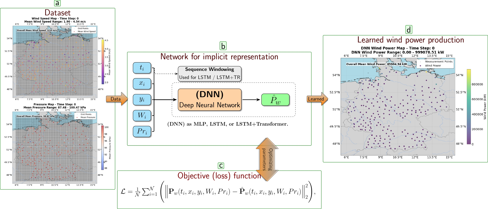

# Climate Aware Deep Neural Network for Wind Power Forecast

## Overview


This repository presents a framework for wind power forecasting using Deep Neural Networks (DNNs) that integrate climate datasets to improve prediction accuracy. The framework leverages data from the Coupled Model Intercomparison Project (CMIP), including wind speed, atmospheric pressure, temperature, and other meteorological variables, to train DNN models. The goal is to predict wind power generation at wind farms in Germany, considering the complex nonlinear relationships between climate data and wind energy output.

The study compares various DNN architectures, such as Multilayer Perceptron (MLP), Long Short-Term Memory (LSTM) networks, and Transformer-enhanced LSTM models, to identify the most effective approach for climate-aware wind power forecasting. The repository includes a Python package, *CADNN*, that supports tasks such as statistical analysis of climate data, data visualization, preprocessing, DNN training, and performance evaluation. The results demonstrate that integrating climate data with DNN models significantly enhances forecasting accuracy, offering valuable insights for wind power generation prediction and adaptability to other regions.


[Download PDF](./CADNN.pdf)



## Dependencies

The following libraries are required for running the code:

- `numpy`
- `torch`
- `scipy`
- `pandas`
- `matplotlib`
- `cartopy`
- `sklearn`
- `tqdm`
You can install these dependencies using `pip`:

```bash
pip install numpy torch scipy pandas matplotlib cartopy scikit-learn tqdm
```

## Installed Packages

```bash
pip list
Package                  Version
------------------------ ------------
aiohappyeyeballs         2.4.3
aiohttp                  3.10.10
aiosignal                1.3.1
async-timeout            4.0.3
attrs                    24.2.0
Cartopy                  0.24.1
certifi                  2024.8.30
cftime                   1.6.4
charset-normalizer       3.4.0
contourpy                1.3.0
cycler                   0.12.1
filelock                 3.13.1
fonttools                4.54.1
frozenlist               1.4.1
fsspec                   2024.2.0
idna                     3.10
Jinja2                   3.1.3
joblib                   1.4.2
kiwisolver               1.4.7
MarkupSafe               2.1.5
matplotlib               3.9.2
mpmath                   1.3.0
multidict                6.1.0
nest-asyncio             1.6.0
netCDF4                  1.7.1.post2
networkx                 3.2.1
numpy                    1.26.3
nvidia-cublas-cu11       11.11.3.6
nvidia-cuda-cupti-cu11   11.8.87
nvidia-cuda-nvrtc-cu11   11.8.89
nvidia-cuda-runtime-cu11 11.8.89
nvidia-cudnn-cu11        9.1.0.70
nvidia-cufft-cu11        10.9.0.58
nvidia-curand-cu11       10.3.0.86
nvidia-cusolver-cu11     11.4.1.48
nvidia-cusparse-cu11     11.7.5.86
nvidia-nccl-cu11         2.20.5
nvidia-nvtx-cu11         11.8.86
packaging                24.1
pandas                   2.2.3
pillow                   10.2.0
pip                      24.3.1
propcache                0.2.0
protobuf                 5.28.2
psutil                   6.0.0
pyparsing                3.1.4
pyproj                   3.7.0
pyshp                    2.3.1
python-dateutil          2.9.0.post0
pytz                     2024.2
requests                 2.32.3
scikit-learn             1.5.2
scipy                    1.14.1
setuptools               65.5.0
shapely                  2.0.6
six                      1.16.0
sympy                    1.12
tensorboardX             2.6.2.2
threadpoolctl            3.5.0
torch                    2.4.1+cu118
torch-geometric          2.6.1
torchaudio               2.4.1+cu118
torchvision              0.19.1+cu118
tqdm                     4.66.5
triton                   3.0.0
typing_extensions        4.9.0
tzdata                   2024.2
urllib3                  2.2.3
yarl                     1.14.0
```


## File Structure

```
.
├── README.md                   # This file
├── nc_files/                   # NetCDF data files for weather projections
│   └── dataset-projections-2020/ # Example data files
├── Results_2020_REMix_ReSTEP_hourly_REF.csv  # Example wind power data file
├── wind_dataset_preparation_psr.py  # Functions to prepare the wind dataset
├── wind_dataset_preparation.py    # Additional data preparation functions
├── wind_deep_simulation_framework.py  # Model definitions for deep learning
├── wind_loss.py                # Loss function for the model
├── wind_trainer.py             # Training framework
└── model_repo/                 # Folder to save trained models
```

## Usage

### Step 1: Data Preparation

The first step is to load and prepare the data. The code extracts wind speed and pressure data from NetCDF files and combines it with real-world wind power data from a CSV file.

You need to provide:

- NetCDF files with weather data (`ps_EUR-11_MPI-M-MPI-ESM-LR_rcp85_r3i1p1_GERICS-REMO2015_v1_3hr_202001010100-202012312200.nc`, etc.)
- A CSV file with real-world wind power data (`Results_2020_REMix_ReSTEP_hourly_REF.csv`)

You can extract the wind speed and pressure data from the NetCDF files using the following functions:

```python
pressure_data, grid_lats, grid_lons = extract_pressure_for_germany(nc_file_path)
wind_speeds, grid_lats, grid_lons = extract_wind_speed_for_germany(nc_file_path)
```

### Step 2: Data Scaling and Preprocessing

Once the data is loaded, it's scaled to prepare it for training. The wind speed, pressure, and wind power data are all normalized using MinMax scaling. This scaling ensures that the model can efficiently learn from the data.

### Step 3: Model Setup

The code uses an LSTM model to predict wind power generation. The model is defined in the `LSTMDeepModel` class. The following parameters are configured for the model:

- `input_size`: The number of input features (5 features: wind speed, pressure, and time data)
- `hidden_features`: The number of hidden units in the LSTM
- `hidden_layers`: The number of layers in the LSTM
- `output_size`: The number of output features (1, the wind power prediction)
- `learning_rate`: The learning rate for optimization

### Step 4: Training the Model

The training is performed using the `LSTMTrainer` class. The model is trained for a specified number of epochs, with loss functions tracked during the process.

```python
Train_inst = LSTMTrainer(
    model_str,
    num_epochs=num_epochs,
    optim_adam=optim_adam,
    scheduler=scheduler,
)
loss_func_list = Train_inst.train_func(train_loader, test_loader)
```

### Step 5: Model Saving

After training, the model is saved to the `model_repo/` directory in both GPU and CPU formats for future use.

```python
torch.save(model_str.state_dict(), model_save_path_gpu)
torch.save(model_str.state_dict(), model_save_path_cpu)
```

The models are saved with filenames reflecting the number of epochs, hidden features, and layers used.

### Example Usage

```python
nc_file_path = 'nc_files/dataset-projections-2020/ps_EUR-11_MPI-M-MPI-ESM-LR_rcp85_r3i1p1_GERICS-REMO2015_v1_3hr_202001010100-202012312200.nc'
csv_file_path = 'Results_2020_REMix_ReSTEP_hourly_REF.csv'

# Extract data
pressure_data, grid_lats, grid_lons = extract_pressure_for_germany(nc_file_path)
wind_speeds, grid_lats, grid_lons = extract_wind_speed_for_germany(nc_file_path)

# Load real-world wind data
target_points = load_real_wind_csv(csv_file_path)

# Interpolate wind speeds and pressure
interpolated_wind_speeds = interpolate_wind_speed(wind_speeds, grid_lats, grid_lons, target_points)
interpolated_pressure = interpolate_pressure(pressure_data, grid_lats, grid_lons, target_points)

# Scale data
scaled_wind_speeds = scale_interpolated_data(interpolated_wind_speeds)
scaled_pressure = scale_interpolated_data(interpolated_pressure)
scaled_target_points = scale_target_points(target_points)

# Combine data
combined_array = combine_data(scaled_target_points, scaled_unix_time_array, scaled_wind_speeds, scaled_pressure, scaled_wind_power)

# Prepare the data for training
wind_dataset_instance = LSTMDataPreparation(combined_array[:,:5], combined_array[:,5:])
x_train_seq, u_train_seq, train_loader, test_loader = wind_dataset_instance.prepare_data_random(0.05)

# Initialize and train the model
lstm_deep_model_instance = LSTMDeepModel(input_size=5, hidden_features=64, hidden_layers=7, output_size=1, learning_rate=1e-3)
model_str, optim_adam, scheduler = lstm_deep_model_instance.run()
loss_func_list = LSTMTrainer(model_str, num_epochs=25000, optim_adam=optim_adam, scheduler=scheduler).train_func(train_loader, test_loader)

# Save the model
torch.save(model_str.state_dict(), 'model_repo/lstm_model.pth')
```

## Notes

- The code uses GPU if available for faster training.
- Ensure that you have the necessary NetCDF data files for weather projections and real-world wind power data.
- Modify the hyperparameters (e.g., `hidden_features`, `hidden_layers`, `learning_rate`) as needed to experiment with different configurations.

## Conclusion

This repository provides a framework for forecasting wind power generation using deep learning techniques, specifically LSTM networks. It processes meteorological data and uses it to train the model, which can then be used for predictions in wind power generation applications.

---

Feel free to adjust any sections to match your specific needs, such as additional setup or details on how to run the code on specific environments!


## Contributing

Pull requests are welcome.

**Author**: **Dr. Ali Forootani**  
**Email**: **aliforootani@ieee.org/aliforootani@gmail.com/ali.forootani@ufz.de**

## License

[MIT](https://choosealicense.com/licenses/mit/)
